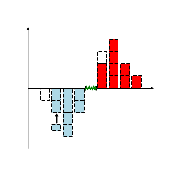

# Description of this page
このページでは、金融・確率過程の分析で**私が使用する**Julia・Python言語のコードやC++で書かれたABMに関するドキュメント・コードを投稿します。ここで投稿するドキュメントの多くは、主に**私の復習用のメモ**として投稿するため、そのドキュメントは、**私が理解可能なレベルまで縮約した解説 + コードの形式**を取ることが多いと思います。誤植や改善したほうがいい点・質問・job offer等は、<a href="#form">ページ下のフォーム</a> から連絡してください。

## Post
### LOB dynamics

|topic|description|link|
|---|---|---|
|LOB|Limit order bookとはなに ?|[View article](OrderBookDynamics/QueueDynamics/WhatLOB.md)|

### About Julia
#### about scientific calculation

|topic|description|markdown|notebook|
|---|---|---|---|
|高速計算 |Juliaの速度を高速化させるためのメモ|[to be coming]|[to be coming]|
|Plots.jl |Plotsの使用方法についてのメモ|[link](./Julia/Plots/index.md)|[link](./Julia/Plots/Plots.html)|
|MPI |MPIの方法|[to be coming]|[to be coming]|

#### about visualization

|topic|description|markdown|notebook|
|---|---|---|---|
|Plots.jl |Plotsの使用方法についてのメモ|[link](./Julia/Plots/index.md)|[link](./Julia/Plots/Plots.html)|

### Statistics

|topic|description|markdown|notebook|
|---|---|---|---|
|EDA |Plotsの使用方法についての説明|[to be coming]|[to be coming]|
|検定論 |Plotsの使用方法についての説明|[to be coming]|[to be coming]|
|回帰分析 |Plotsの使用方法についての説明|[to be coming]|[to be coming]|
|因果推論 |Juliaの速度を高速化させるためのメモ|[to be coming]|[to be coming]|

### Optimization

|topic|description|markdown|notebook|
|---|---|---|---|
|JuMP |Plotsの使用方法についての説明|[to be coming]|[to be coming]|
|ポートフォリオの最適化 |Plotsの使用方法についての説明|[to be coming]|[to be coming]|
|Noise and Eigenvector |Plotsの使用方法についての説明|[to be coming]|[to be coming]|
|Optim |Plotsの使用方法についての説明|[to be coming]|[to be coming]|
|非線形フィッティングの例 |最尤法の実装|[to be coming]|[to be coming]|

### Time series analysis

|topic|description|markdown|notebook|
|---|---|---|---|
|フーリエ解析 |Juliaの速度を高速化させるためのメモ|[to be coming]|[to be coming]|
|時系列解析 |Juliaの速度を高速化させるためのメモ|[to be coming]|[to be coming]|
|Random Matrix |Juliaの速度を高速化させるためのメモ|[to be coming]|[to be coming]|
|Event data解析 |Juliaの速度を高速化させるためのメモ|[to be coming]|[to be coming]|
|Neural spike data analysis|Juliaの速度を高速化させるためのメモ|[to be coming]|[to be coming]|
|高頻度ファイナンス |Juliaの速度を高速化させるためのメモ|[to be coming]|[to be coming]|

### 素材
下記のリンクで提示している画像・コードは、非営利目的の場合に限り自由に使用してください。

These pictures and codes on the following link are available without notification as long as it is not for commercial purposes, which means a creative commons license protects it.

| Order book | adfaa |
| ---- | ---- |
|  |  |
| [View source](materials/OrderBook/OrderBook.md)| [View source](materials/Queue/Queue.md) |

<iframe src="https://forms.gle/MKF8EPFjNU3b8Ro47" width="640" height="382" frameborder="0" marginheight="0" marginwidth="0" id="form">Loading…</iframe>