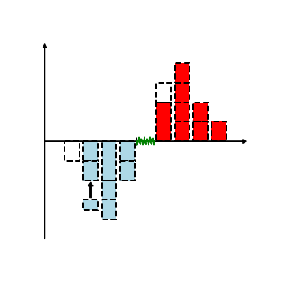

# Order Bookのイメージ画像


下記のコードを実行すると、オーダーブック (limit order book, LOB) のイメージ画像のを作成することができます。
```python
import pandas as pd
import numpy as np
import matplotlib.pyplot as plt
import seaborn as sns

fig,ax1=plt.subplots(figsize=(5,5))
ax1.axis("off")

#%%-- ask
# execution

ax1.bar(np.array([1]),np.array([2]),bottom=np.array([0]),color="red",align="center", edgecolor='black', linewidth=2,linestyle="--")
ax1.bar(np.array([1]),np.array([1]),bottom=np.array([2]),color="None",align="center", edgecolor='black', linewidth=2,linestyle="--")
ax1.bar(np.array([2]),np.array([1]),color="red",align="center", edgecolor='black', linewidth=2,linestyle="--")
ax1.bar(np.array([2]),np.array([1]),bottom=np.array([1]),color="red",align="center", edgecolor='black', linewidth=2,linestyle="--")
ax1.bar(np.array([2]),np.array([1]),bottom=np.array([2]),color="red",align="center", edgecolor='black', linewidth=2,linestyle="--")
ax1.bar(np.array([2]),np.array([1]),bottom=np.array([3]),color="red",align="center", edgecolor='black', linewidth=2,linestyle="--")

ax1.bar(np.array([3]),np.array([1]),color="red",align="center", edgecolor='black', linewidth=2,linestyle="--")
ax1.bar(np.array([3]),np.array([1]),bottom=np.array([1]),color="red",align="center", edgecolor='black', linewidth=2,linestyle="--")

ax1.bar(np.array([4]),np.array([1.]),color="red",align="center", edgecolor='black', linewidth=2,linestyle="--")


#%%-- bid
ax1.bar(-np.array([1]),-np.array([1]),color="lightblue",align="center", edgecolor='black', linewidth=2,linestyle="--")
ax1.bar(-np.array([1]),-np.array([1]),bottom=np.array([-1]),color="lightblue",align="center", edgecolor='black', linewidth=2,linestyle="--")


ax1.bar(-np.array([2]),-np.array([2.]),color="lightblue",align="center", edgecolor='black', linewidth=2,linestyle="--")
ax1.bar(-np.array([2]),-np.array([1.]),bottom=-np.array([2.]),color="lightblue",align="center", edgecolor='black', linewidth=2,linestyle="--")
ax1.bar(-np.array([2]),-np.array([1.]),bottom=-np.array([3.]),color="lightblue",align="center", edgecolor='black', linewidth=2,linestyle="--")


ax1.bar(-np.array([3]),-np.array([1.]),color="lightblue",align="center", edgecolor='black', linewidth=2,linestyle="--")
ax1.bar(-np.array([3]),-np.array([1.]),bottom=-np.array([1.]),color="lightblue",align="center", edgecolor='black', linewidth=2,linestyle="--")
ax1.arrow(x=-3,y=-2.9,dx=0,dy=.8,width=0.1
          ,head_width=.3,head_length=0.2,
          length_includes_head=True,color='k')


ax1.bar(-np.array([3]),-np.array([.5]),bottom=-np.array([3.]),
        color="lightblue",align="center", edgecolor='black', linewidth=2,linestyle="--")
"""
ax1.arrow(x=-4.4,y=-3.7,dx=.8,dy=.4,width=0.1
          ,head_width=.3,head_length=0.2,
          length_includes_head=True,color='k')
ax1.text(-5.4,-4, "Limit Order", size=12,verticalalignment='center',)
"""

ax1.bar(-np.array([4]),-np.array([1.]),color="None",align="center", edgecolor='black', linewidth=2,linestyle="--")
"""
ax1.arrow(x=-4,y=1.,dx=0,dy=-.8,width=0.1
          ,head_width=.3,head_length=0.2,
          length_includes_head=True,color='k')
ax1.text(-5.4,1.3, "Cancel Order", size=12,verticalalignment='center',)
"""

ax1.errorbar([0],[0],xerr = [.5],capsize=5, markersize=10, ecolor='black', markeredgecolor = "black", color='w')
x=np.linspace(-.5,.5,100)
import matplotlib as mpl

with mpl.rc_context({'path.sketch': (5, 15, 1)}):
    ax1.plot(x, x*0, color = 'green', label = 'spread')

ax1.arrow(x=-5.5,y=0,dx=11,dy=.0,width=0.01
          ,head_width=.2,head_length=0.2,
          length_includes_head=True,color='k')
ax1.arrow(x=-5.5,y=-5,dx=0,dy=10,width=0.01
          ,head_width=.2,head_length=0.2,
          length_includes_head=True,color='k')
ax1.set_xlim([-6,6])
fig.show()
```


<a rel="license" href="http://creativecommons.org/licenses/by-nc/4.0/"></a><br />この 作品 は <a rel="license" href="http://creativecommons.org/licenses/by-nc/4.0/">クリエイティブ・コモンズ 表示 - 非営利 4.0 国際 ライセンス</a>の下に提供されています。